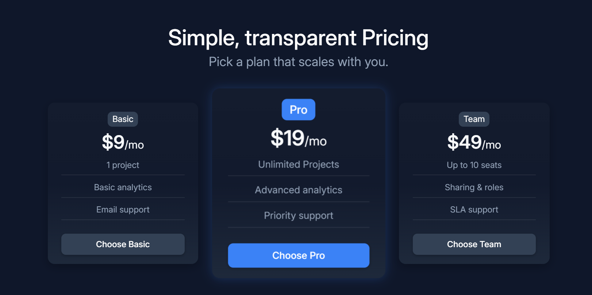

# 💳 3-Plan Responsive Pricing Section

A clean, modern **responsive pricing card section** built using **pure HTML + CSS**.  
Features a dark theme, smooth hover animations, and a highlighted “Pro” plan for visual emphasis.

---

## 🖼️ Preview



---

## ✨ Features

- 🌓 Dark, modern color palette (`#0f172a`, `#1e293b`, `#3b82f6`)
- 🎯 Fully responsive (stacks neatly on mobile)
- 💡 Highlighted “Pro” card with subtle glow
- 🎨 Smooth hover transitions on cards and buttons
- 🧩 Simple, semantic, and reusable markup

---

## 🧱 Built With

- **HTML5**
- **CSS3 (Flexbox, custom properties)**

---

## 🚀 Quick Start

```bash
# Clone the repo
git clone https://github.com/<your-username>/pricing-cards.git

# Move into the folder
cd pricing-cards

# Open in browser
open index.html   # or just double-click the file
```
